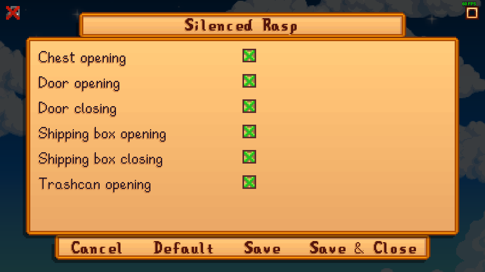

### Mod name
Silenced Rasp for Stardew Valley 1.6+

### Brief overview
Mutes chest, door, shipping box and trashcan sounds.

### Config Menu

### Detailed description
Tested with Stardew Valley 1.6.3  
This content pack for [Content Patcher](https://www.nexusmods.com/stardewvalley/mods/1915) allows you to replace the rasping sounds with silence.  
Requires [SMAPI](https://github.com/Pathoschild/SMAPI).  
You can pick which one to mute with [Generic Mod Config Menu](https://www.nexusmods.com/stardewvalley/mods/5098).  
Restart the game after you've made any changes.
